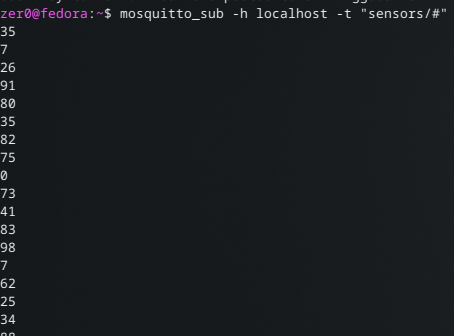
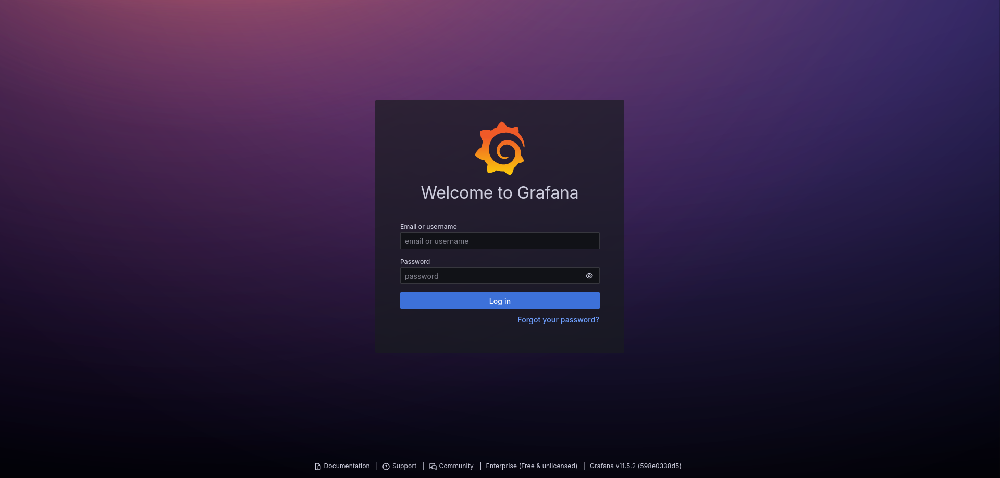
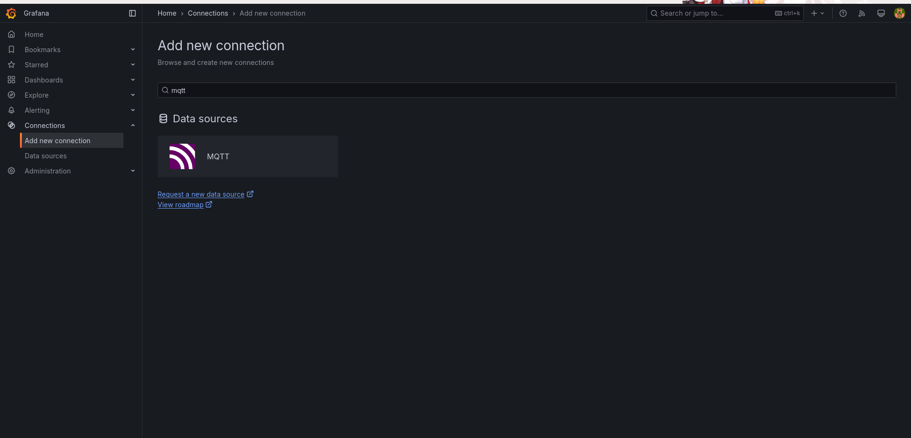
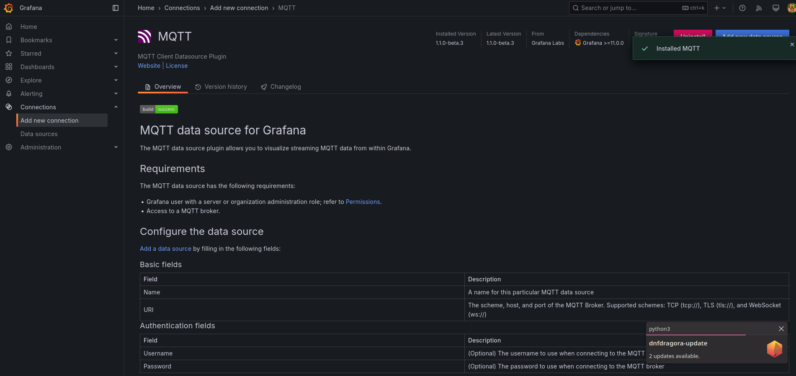

# M321-MQTT

## What is MQTT
MQTT(Message Queuing Telemetry Transport) is a lightweight, open protocol that is used for Messageexchange. MQTT is specialized for Enviorments with limited bandwidth and high latencies and i is commonly used in the IoT-World(Internet of Things) because of the efficency and reliability of the System.

## Install guide for Fedora in Docker
1. create a folder where as you create a config, data and  a log directory. Also create a mosquitto.conf file in the config folder with the following contents
```conf
listener 1883
allow_anonymous true
```
2. now create a docker-compose file with this content
```yml
services:
  mosquitto:
    image: eclipse-mosquitto
    container_name: mos1
    ports:
      - "1883:1883" 
    volumes:
      - ./config/mosquitto.conf:/mosquitto/config/mosquitto.conf
      - ./data:/mosquitto/data
      - ./log:/mosquitto/log
```
so your directory should look like this 

3. run `docker compose up -d`


4. it should be up and running now! We validate that MQTT is working with the following command
```bash
mosquitto_pub -h localhost -t "test/topic" -m "Hallo, MQTT mit Docker!"
```
5. and you can subscribe from another console to test the subscribe function
```bash
mosquitto_sub -h localhost -t "test/topic"
```
6. so if you send a message with `mosquitto_pub` it should be shown in the console where `mosquitto_sub` is running.

Congrats!! you successfully setup MQTT.


## How does MQTT work? 
MQTT contains of 3 Components
### Broker
The Broker is the central element of the MQTT-Network. He takes the messages of the Clients and spreads them across the other Clients, that are interestet in certain topics
### Clients
A MQTT-Client can be a Sensor, a Computer, a Smartphone or a completely different IoT-device. The device can be either:
- **a Publisher:** that sends Data to different topics <br>
or
- **a Subscriber:** that receives Data from specific topics
### Topics
MQTT uses a Topic hiearchy for the organisation of messages for example: <br>
home/livingroom/temperature
- home -> main category
- livingroom -> sub category
- temperature -> sensorvalue
## Using MQTT with Dummy Sensors
To test how MQTT works we will make a System with 3 Sensors and we will Visualize it with Grafana later
this is how the concept looks.

So we continue with creating some Dummy Sensors with a simple bash script that looks like this:
```bash
#!/bin/bash

# check if the user started the script with a parameter
if [ -z "$1" ]; then
  echo "Usage: $0 sensor_name"
  exit 1
fi

SENSOR_NAME=$1
TOPIC="sensors/$SENSOR_NAME"

echo "start the sensor with name: $SENSOR_NAME, send the dates to $TOPIC..."

# Endless loop for sending random values
while true; do
  VALUE=$(( RANDOM % 100 )) 
  mosquitto_pub -h localhost -t "$TOPIC" -m "$VALUE"
  echo "[$(date +%H:%M:%S)] $SENSOR_NAME sendet: $VALUE"
  sleep 1
done
```
with this simple script you can now create dummy sensors but first you need execute permissions with: 
`chmod +x sensor.sh` <br>
now you can create sensors with
`./sensor.sh "nameofsensor"` <br>
Congrats if you create your sensors now and subscribe with `mosquitto_sub -h localhost -t "sensors/#"` and you can see your sensors sending random "temperatures"!


## Visualize your Data with Grafana
1. To visualize your Data we use Grafana so lets install it with dnf 
`sudo dnf install Grafana` 
2. after the installation you have to start it with: `systemctl start grafana-server
3. go to localhost:3000
4. you have to login at first login it will be user: admin password: admin 
5. install the MQTT plugin on the Add new connection tab 
6. now link your Data sources with your MQTT with `tcp://localhost:1883` 
7. now configure your Dashboard with your sensors 
8. Congrats! now you can see the temperature visualizing on the Graph :)
